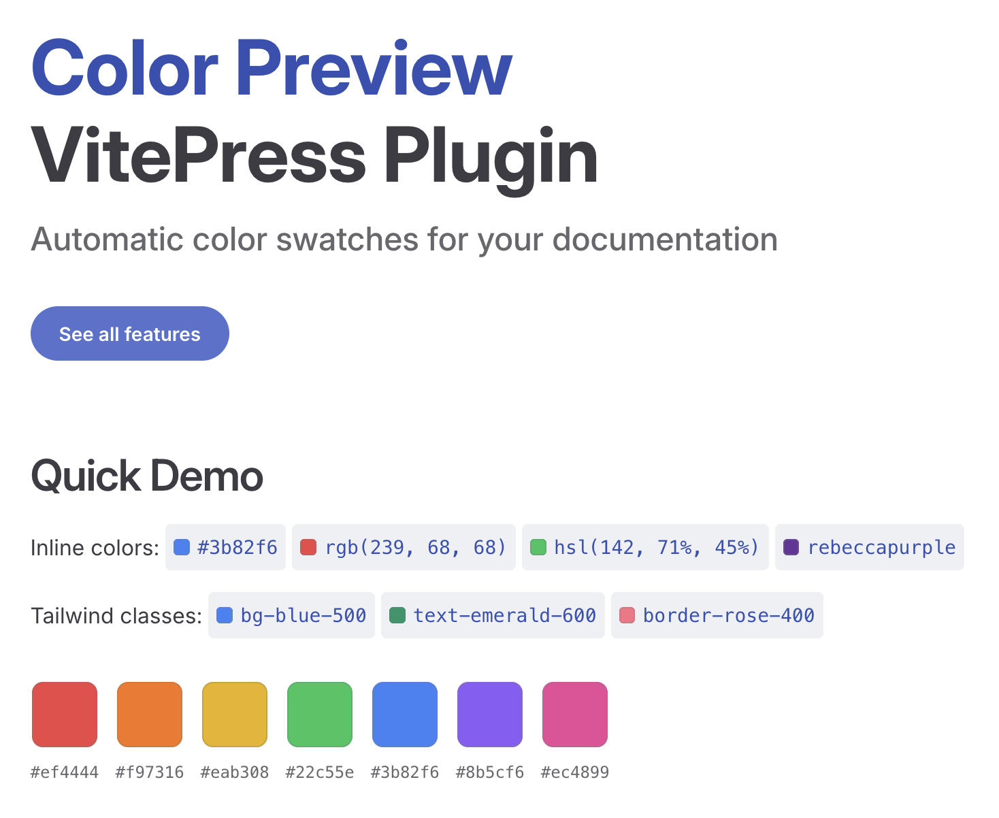
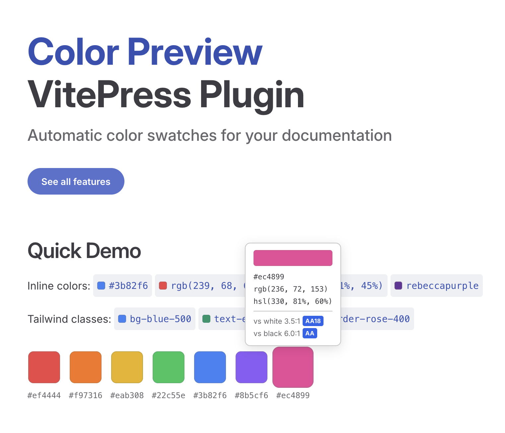
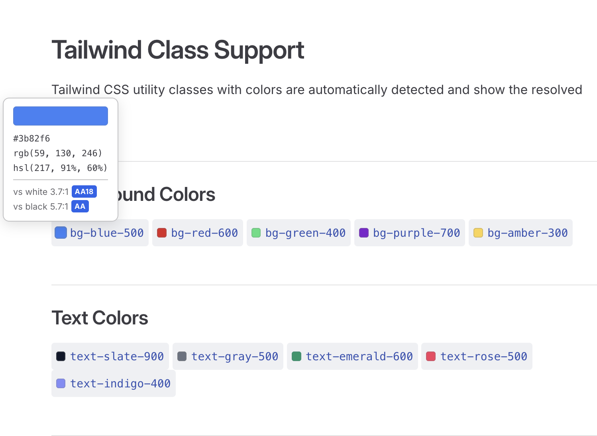

# vitepress-plugin-color-preview

Automatic color swatches for your VitePress documentation. Detects CSS color values and Tailwind classes in your markdown and renders inline previews.



## Features

- **Inline code swatches** — `#3b82f6`, `rgb(239, 68, 68)`, `hsl(142, 71%, 45%)`, `rebeccapurple`
- **Fenced code blocks** — swatches inside CSS, SCSS, JS, TS code blocks
- **Color palettes** — `:::colors` container for visual palette display
- **Tailwind classes** — `bg-blue-500`, `text-emerald-600`, `border-rose-400`
- **Click to copy** — click any swatch to copy the color value
- **WCAG contrast** — hover tooltip shows contrast ratio against white/black with AA/AAA badges
- **Format conversion** — hover tooltip shows HEX, RGB, and HSL
- **Dark mode** — adapts to VitePress light/dark theme

### Supported color formats

| Format     | Examples                                           |
| ---------- | -------------------------------------------------- |
| Hex        | `#f00` `#ff6600` `#ff660080`                       |
| RGB/RGBA   | `rgb(255, 100, 0)` `rgba(255, 100, 0, 0.5)`        |
| Modern RGB | `rgb(255 100 0 / 50%)`                             |
| HSL/HSLA   | `hsl(30, 100%, 50%)` `hsla(30, 100%, 50%, 0.5)`    |
| Modern HSL | `hsl(30 100% 50% / 50%)`                           |
| OKLCH      | `oklch(70% 0.15 30)`                               |
| OKLAB      | `oklab(70% 0.1 -0.05)`                             |
| Named      | `red` `cornflowerblue` `rebeccapurple`             |
| Tailwind   | `bg-blue-500` `text-emerald-600` `border-rose-400` |

## Install

```bash
npm install vitepress-plugin-color-preview
```

## Setup

### 1. VitePress config

```ts
// .vitepress/config.ts
import { colorPreviewPlugin, colorPreviewTransformer } from 'vitepress-plugin-color-preview'

export default {
  markdown: {
    config(md) {
      md.use(colorPreviewPlugin)
    },
    codeTransformers: [colorPreviewTransformer()],
  },
}
```

`colorPreviewPlugin` handles inline code and `:::colors` palette blocks. `colorPreviewTransformer` handles fenced code blocks. Both are optional — use only what you need.

### 2. Theme setup

```ts
// .vitepress/theme/index.ts
import DefaultTheme from 'vitepress/theme'
import { setupColorPreview } from 'vitepress-plugin-color-preview/client'
import 'vitepress-plugin-color-preview/style.css'
import { onMounted } from 'vue'

export default {
  extends: DefaultTheme,
  setup() {
    onMounted(() => setupColorPreview())
  },
}
```



The client setup enables interactive features (hover tooltips and click-to-copy). The CSS import is required for swatch styling. If you only want static swatches without interactivity, you can skip `setupColorPreview()` and just import the CSS.

## Usage

### Inline code

Write color values in backticks and they automatically get a swatch:

```md
The primary color is `#3b82f6` and the accent is `hsl(280, 67%, 60%)`.
```

### Tailwind classes



Tailwind utility classes are detected automatically:

```md
Use `bg-blue-500` for the button and `text-gray-900` for the label.
```

Supports all default Tailwind v3 color utilities including `bg-`, `text-`, `border-`, `ring-`, `fill-`, `stroke-`, `from-`, `via-`, `to-`, and more.

### Fenced code blocks

Colors in code blocks get small inline swatches:

````md
```css
:root {
  --primary: #3b82f6;
  --danger: #ef4444;
}
```
````

### Color palettes

Use the `:::colors` container to render a visual palette:

```md
:::colors
#ef4444 #f97316 #eab308 #22c55e #3b82f6 #8b5cf6 #ec4899
:::
```

This renders large clickable swatches with labels underneath. Supports multiple lines:

```md
:::colors
#1e293b #334155 #475569
#64748b #94a3b8 #cbd5e1
:::
```

## API

### Server-side (markdown-it)

```ts
import { colorPreviewPlugin, colorPreviewTransformer } from 'vitepress-plugin-color-preview'

// markdown-it plugin — inline code + :::colors palettes
md.use(colorPreviewPlugin)

// Shiki transformer — fenced code blocks
const transformer = colorPreviewTransformer()
```

### Client-side (browser)

```ts
import { setupColorPreview } from 'vitepress-plugin-color-preview/client'

// Enables hover tooltips and click-to-copy
setupColorPreview()
```

### Utilities

```ts
import {
  extractColor,
  findColorsInText,
  isNamedColor,
  extractTailwindColor,
} from 'vitepress-plugin-color-preview'

extractColor('#ff6600') // '#ff6600'
extractColor('rebeccapurple') // 'rebeccapurple'
extractColor('not a color') // null

findColorsInText('color: #ff6600;') // [{ value: '#ff6600', index: 7, length: 7 }]

isNamedColor('coral') // true

extractTailwindColor('bg-blue-500') // '#3b82f6'
extractTailwindColor('p-4') // null
```

## Contributors

<!-- ALL-CONTRIBUTORS-LIST:START -->
<table>
  <tr>
    <td align="center"><a href="https://github.com/DubPirate"><br /><sub><b>Allan Asp</b></sub></a></td>
  </tr>
</table>
<!-- ALL-CONTRIBUTORS-LIST:END -->

Contributions are welcome! See [CONTRIBUTING.md](CONTRIBUTING.md) for details.

## License

MIT
